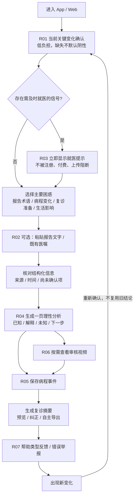
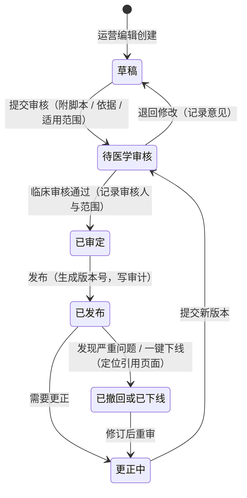
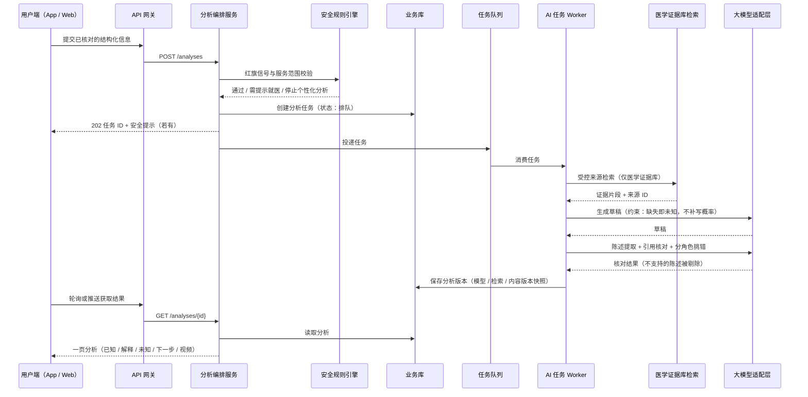

# 腰有据 · 系统设计（整理自 FigJam《系统设计图 V0.1》）

本文件整理自设计方的系统设计图，包括总体架构、用户主流程、ER 图、内容审核状态机和“一页分析”时序图。
与原设计的差异（本项目为演示实现）见 `brief.md` 的“演示实现的简化”一节。

## 1. 总体架构（模块化单体 + AI Worker）

- 客户端：App 端（Android / H5，uni-app）、Web 端（Vue 3）、后台管理系统（Vue 3），均通过 HTTPS 访问 API 网关。
- API 网关（原设计为 Nginx，含 WAF、限流、TLS）按路径分发：

| 路径 | 服务 | 读写 |
|-|-|-|
| `/auth` | 用户与授权服务 | 读写身份隔离库（字段加密）；短信验证码 |
| `/episodes` | 病程记录服务 | 写病程事件到业务库 |
| `/reports` | 报告解析服务 | 存报告原文到对象存储；OCR 文本提取（可选） |
| `/analyses` | 分析编排服务（RAG） | 调安全规则引擎做红旗与范围校验；投递分析任务到队列 |
| `/contents` | 内容库服务 | 内容与版本存对象存储；视频经 CDN 分发 |
| `/feedback` | 反馈与质量服务 | 反馈与举报写业务库 |
| `/admin` | 后台管理与审计服务 | 写审计日志库（只追加） |

- 安全规则引擎：被分析编排服务调用，命中时写安全事件到业务库。
- AI 任务 Worker：从任务队列消费分析任务；只在医学证据库中受控检索；通过可替换的大模型适配层生成与核对；把分析版本保存到业务库。
- 数据与外部依赖（原设计）：PostgreSQL 业务库、身份隔离库（字段加密）、医学证据向量库（pgvector）、对象存储 OSS、审计日志库（只追加）、任务队列（Redis Streams）、大模型服务商、OCR、短信 / 推送、视频 CDN。

## 2. 用户主流程（R01–R07）

## 3. 数据模型（ER）

关系：

| 从 | 关系 | 到 |
|-|-|-|
| USER | isolates | IDENTITY_PROFILE |
| USER | grants | CONSENT |
| USER | owns | EPISODE |
| USER | triggers | SAFETY_EVENT |
| EPISODE | contains | CARE_EVENT |
| EPISODE | generates | ANALYSIS |
| EPISODE | exports | FOLLOWUP_SUMMARY |
| CARE_EVENT | attaches | REPORT |
| CARE_EVENT | records | SYMPTOM_LOG |
| ANALYSIS | cites | ANALYSIS_CITATION |
| ANALYSIS | receives | FEEDBACK |
| EVIDENCE_DOC | splits | EVIDENCE_CHUNK |
| CONTENT_ITEM | versions | CONTENT_VERSION |
| CONTENT_VERSION | reviewed_by | REVIEW_RECORD |
| CONTENT_VERSION | based_on | EVIDENCE_DOC |
| ADMIN_USER | signs | REVIEW_RECORD |
| ADMIN_USER | has | ROLE |
| ADMIN_USER | produces | AUDIT_LOG |
| MODEL_RELEASE | evaluated_by | EVAL_RUN |
| EVAL_SET | runs | EVAL_RUN |
| MODEL_RELEASE | controlled_by | FEATURE_SWITCH |
| CASE_SUBMISSION | moderated_by | REVIEW_RECORD |

表结构（“说明”列中的 `A | B | C` 表示可选值）：

### USER

| 类型 | 字段 | 键 | 说明 |
|-|-|-|-|
| uuid | id | PK | 匿名内部标识 |
| string | status |  |  |
| datetime | created_at |  |  |
| datetime | retention_until |  | 保存期限 |

### IDENTITY_PROFILE

| 类型 | 字段 | 键 | 说明 |
|-|-|-|-|
| uuid | user_id | PK,FK |  |
| string | phone_enc |  | 字段加密, 独立库 |
| string | real_name_enc |  |  |

### CONSENT

| 类型 | 字段 | 键 | 说明 |
|-|-|-|-|
| uuid | id | PK |  |
| uuid | user_id | FK |  |
| string | scope |  | 健康信息处理 / 分享 / 产品改进 |
| datetime | granted_at |  |  |
| datetime | revoked_at |  |  |

### EPISODE

| 类型 | 字段 | 键 | 说明 |
|-|-|-|-|
| uuid | id | PK |  |
| uuid | user_id | FK |  |
| string | title |  |  |
| date | onset_date |  | 可为空 = 尚未确认 |
| string | onset_certainty |  |  |
| string | status |  |  |

### CARE_EVENT

| 类型 | 字段 | 键 | 说明 |
|-|-|-|-|
| uuid | id | PK |  |
| uuid | episode_id | FK |  |
| string | event_type |  | 报告 / 症状 / 医嘱 / 行动 / 结局 |
| datetime | occurred_at |  |  |
| datetime | reported_at |  |  |
| string | source_type |  | 自述 / 报告原文 / 医生记录 |
| text | raw_text |  | 原文片段 |
| string | verify_status |  | 已确认 / 尚未确认 / 有冲突 |

### REPORT

| 类型 | 字段 | 键 | 说明 |
|-|-|-|-|
| uuid | id | PK |  |
| uuid | care_event_id | FK |  |
| date | report_date |  |  |
| text | raw_text |  |  |
| json | extracted_terms |  | L5/S1 等术语与原文位置 |
| string | oss_key |  |  |

### SYMPTOM_LOG

| 类型 | 字段 | 键 | 说明 |
|-|-|-|-|
| uuid | id | PK |  |
| uuid | care_event_id | FK |  |
| int | sit_minutes |  | 今天能坐多久 |
| string | planned_activity_done |  |  |
| int | sleep_impact |  |  |
| text | top_worry |  |  |
| string | leg_change |  | 有 / 无 / 尚未确认 |

### ANALYSIS

| 类型 | 字段 | 键 | 说明 |
|-|-|-|-|
| uuid | id | PK |  |
| uuid | episode_id | FK |  |
| int | version |  |  |
| uuid | model_release_id | FK |  |
| json | sections |  | 已知 / 解释 / 未知 / 下一步 / 视频 |
| json | retrieval_snapshot |  |  |
| string | safety_flag |  |  |
| datetime | created_at |  |  |

### ANALYSIS_CITATION

| 类型 | 字段 | 键 | 说明 |
|-|-|-|-|
| uuid | id | PK |  |
| uuid | analysis_id | FK |  |
| uuid | evidence_doc_id | FK |  |
| text | statement |  | 可核实陈述 |
| bool | supported |  |  |

### FOLLOWUP_SUMMARY

| 类型 | 字段 | 键 | 说明 |
|-|-|-|-|
| uuid | id | PK |  |
| uuid | episode_id | FK |  |
| json | content |  |  |
| string | export_format |  | PDF / 图片 / 文本 |
| datetime | exported_at |  |  |

### FEEDBACK

| 类型 | 字段 | 键 | 说明 |
|-|-|-|-|
| uuid | id | PK |  |
| uuid | analysis_id | FK |  |
| string | help_type |  | 看懂了 / 知道下一步 / 都不好 |
| text | unsolved_question |  |  |
| bool | is_error_report |  |  |

### SAFETY_EVENT

| 类型 | 字段 | 键 | 说明 |
|-|-|-|-|
| uuid | id | PK |  |
| uuid | user_id | FK |  |
| string | rule_code |  |  |
| string | severity |  |  |
| string | action_taken |  | 提示就医 / 停止个性化 |
| datetime | created_at |  |  |

### EVIDENCE_DOC

| 类型 | 字段 | 键 | 说明 |
|-|-|-|-|
| uuid | id | PK |  |
| string | title |  |  |
| string | source_type |  | 指南 / 研究 / 审核科普 |
| string | source_url |  |  |
| string | license |  |  |
| date | verified_at |  |  |
| bool | active |  |  |

### EVIDENCE_CHUNK

| 类型 | 字段 | 键 | 说明 |
|-|-|-|-|
| uuid | id | PK |  |
| uuid | doc_id | FK |  |
| text | content |  |  |
| vector | embedding |  |  |
| int | position |  |  |

### CONTENT_ITEM

| 类型 | 字段 | 键 | 说明 |
|-|-|-|-|
| uuid | id | PK |  |
| string | type |  | 视频 / 图文组件 |
| string | title |  |  |
| string | applicable_scope |  | 适用范围 |
| string | not_applicable |  | 不适用范围 |
| string | current_status |  | 草稿 / 待审 / 已审定 / 已发布 / 已撤回 |
| bool | offline_switch |  | 下线开关 |

### CONTENT_VERSION

| 类型 | 字段 | 键 | 说明 |
|-|-|-|-|
| uuid | id | PK |  |
| uuid | item_id | FK |  |
| int | version |  |  |
| text | script |  | 脚本 |
| string | asset_key |  | 视频 / 图文资源 |
| text | subtitle_text |  | 字幕与替代文字 |
| string | model_asset_version |  |  |
| datetime | published_at |  |  |

### REVIEW_RECORD

| 类型 | 字段 | 键 | 说明 |
|-|-|-|-|
| uuid | id | PK |  |
| uuid | target_id | FK |  |
| string | target_type |  |  |
| uuid | reviewer_id | FK |  |
| string | decision |  | 通过 / 退回 / 撤回 |
| string | review_scope |  |  |
| text | comment |  |  |
| datetime | reviewed_at |  |  |

### ADMIN_USER

| 类型 | 字段 | 键 | 说明 |
|-|-|-|-|
| uuid | id | PK |  |
| string | name |  |  |
| uuid | role_id | FK |  |
| bool | mfa_enabled |  |  |

### ROLE

| 类型 | 字段 | 键 | 说明 |
|-|-|-|-|
| uuid | id | PK |  |
| string | name |  | 运营编辑 / 临床审核 / 技术 / 合规 / 超级管理 |
| json | permissions |  | 最小必要, 不含完整病历 |

### AUDIT_LOG

| 类型 | 字段 | 键 | 说明 |
|-|-|-|-|
| uuid | id | PK |  |
| uuid | actor_id | FK |  |
| string | action |  |  |
| string | target |  |  |
| json | diff |  |  |
| datetime | created_at |  | 只追加不可改 |

### MODEL_RELEASE

| 类型 | 字段 | 键 | 说明 |
|-|-|-|-|
| uuid | id | PK |  |
| string | model_name |  |  |
| string | prompt_version |  |  |
| string | retrieval_strategy |  |  |
| string | content_lib_version |  |  |
| string | status |  | 灰度 / 生效 / 已回滚 |

### EVAL_RUN

| 类型 | 字段 | 键 | 说明 |
|-|-|-|-|
| uuid | id | PK |  |
| uuid | model_release_id | FK |  |
| uuid | eval_set_id | FK |  |
| json | metrics |  |  |
| string | result |  | 通过 / 阻断发布 |

### EVAL_SET

| 类型 | 字段 | 键 | 说明 |
|-|-|-|-|
| uuid | id | PK |  |
| string | name |  | 错误安慰 / 关键遗漏 / 左右侧混淆 / 隐私 |
| int | case_count |  |  |
| bool | deidentified |  |  |

### FEATURE_SWITCH

| 类型 | 字段 | 键 | 说明 |
|-|-|-|-|
| uuid | id | PK |  |
| string | key |  | 个性化分析 / 视频推荐 / 案例卡片 |
| bool | enabled |  |  |
| text | reason |  |  |

### CASE_SUBMISSION

| 类型 | 字段 | 键 | 说明 |
|-|-|-|-|
| uuid | id | PK |  |
| uuid | user_id | FK |  |
| text | edited_content |  | 去除第三方信息 |
| string | consent_scope |  | 发表 / 产品改进 / 训练 |
| string | status |  | 待审 / 已发布 / 已撤回 |

## 4. 内容审核状态机

## 5. “一页分析”生成时序（RAG + 安全流程）

